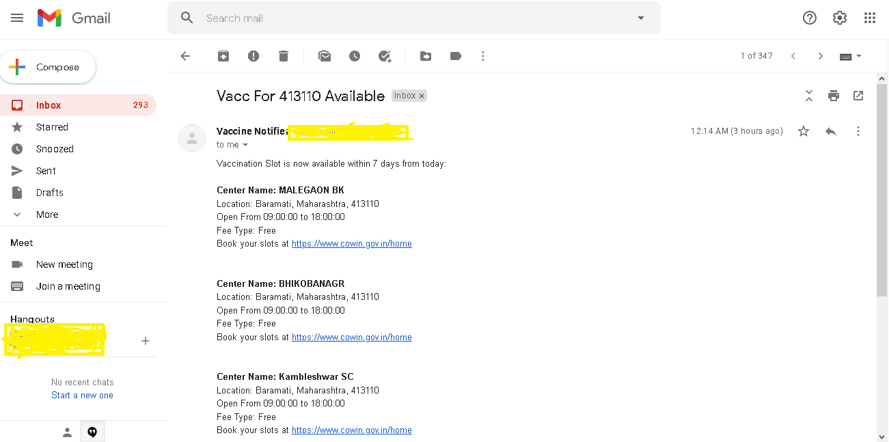

<h3 align="left">Vaccine Notifier</h3>

<p align="left">
To facilitate easier use of the website for vaccination registration <a href="https://www.cowin.gov.in/home">CoWin</a>, I have developed this notification software which will notify users through email whenever vaccination slots become available. It will keep searching for free slots based on the <b>pincodes</b> provided and the <b>age</b> of person, until the software is stopped. Notifications can be sent to <b>multiple email IDs</b>.
</p>

<details open="open">
  <summary><h4>Table of Contents</h2></summary>
  <ol>
    <li><a href="#quick-installation-steps">Quick Installation Steps</a></li>
    <li><a href="#built-with">Built With</a></li>
    <li><a href="#about-cowin">About CoWin</a></li>
    <li>
      <a href="#getting-started">Getting Started</a>
      <ul>
        <li><a href="#prerequisites">Prerequisites</a></li>
        <li><a href="#project-setup">Project Setup</a></li>
        <li><a href="#building-the-project">Building the project</a></li>
      </ul>
    </li>
    <li><a href="#vaccine-notification-sample">Vaccine notification sample</a></li>
  </ol>
</details>

## Quick Installation Steps
All steps for simply running the software can be found in the "installation files" folder in the project. Installation files can be found there as well, but for latest binaries check the releases section.

## Built With

* [Node.js](https://nodejs.org/)

## About CoWin
All vaccination related information used in the project is obtained from the public APIs exposed by the Indian Govt's <a href="https://apisetu.gov.in/public/api/cowin">API Setu</a> website. 

## Getting Started

### Prerequisites
* Compatible versions of Node.js and npm
* Any IDE supporting Node.js development(Visual Studio Code)
* Git installed and configured
* Gmail Account for sending email notifications programatically. Login to your Gmail Account (Use a relatively unimportant email ID for setting up SMTP for Gmail) and go to <a href='https://myaccount.google.com/lesssecureapps'>https://myaccount.google.com/lesssecureapps</a> and set less secure app access to 'ON'. Alternatively follow these links: https://help.inspectionsupport.net/en/articles/109541-smtp-for-gmail , https://support.google.com/accounts/answer/185833

### Project Setup
1. Clone the repo
   ```sh
   git clone https://github.com/keertan-pius/vaccine_notifier.git
   ```
2. Install NPM packages
   ```sh
   npm install
   ```
3. Enter all required data in `vaccine_notifier.properties` like email details, pincodes, age, recipient email IDs and cron job time. For example:
   ```JS
   PINCODES=400004,400081,410909,410100
   EMAIL_RECIPIENTS=recipient1@anymail.com,recipient2@anymail.com
   ```
4. Execute command
   ```sh
   node .\index.js
   ```
5. Project should be up and running

### Building the project

Execute below command to obtain 3 different binaries for windows, linux and macOS.
   ```sh
   npm run build
   ```
   
## Email Notification Sample
